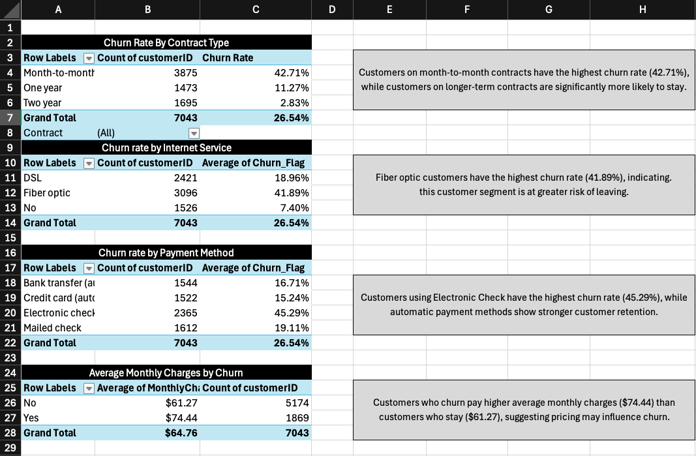
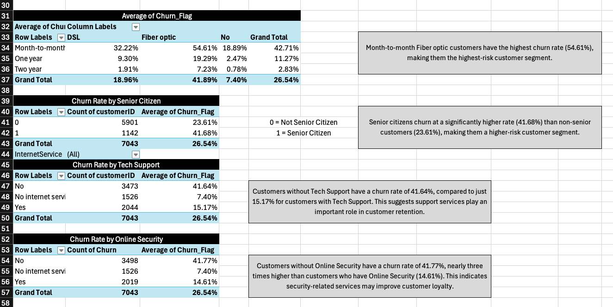
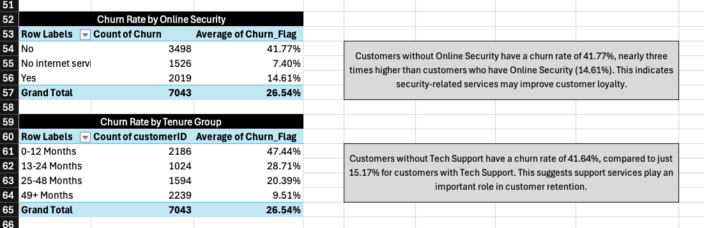

# Telco Customer Churn Analysis

## Project Overview

Customer churn is one of the most important challenges for subscription-based businesses. Losing existing customers impacts revenue, increases acquisition costs, and slows business growth.

In this project, I analysed over **7,000 customer records** to identify the factors most strongly associated with customer churn. Using Excel PivotTables and customer segmentation techniques, I transformed raw data into actionable business insights and recommendations.

The objective was to answer a key business question:

**Which customer groups are most likely to churn, and what actions could the business take to improve retention?**

---

## Dashboard Overview

### Customer Churn Analysis Dashboard

This section focuses on the relationship between customer churn and key business factors including contract type, internet service, payment method, monthly charges, and customer demographics.

Key findings include:

* Month-to-month customers have the highest churn rate (42.71%).
* Fiber optic customers churn at almost double the rate of DSL customers.
* Electronic Check users are significantly more likely to leave than customers using automated payment methods.
* Customers who churn pay higher average monthly charges than retained customers.

---

### Customer Risk Segmentation

This analysis explores how multiple customer characteristics combine to influence churn.

Key findings include:

* Month-to-month Fiber optic customers represent the highest-risk customer segment, with a churn rate of 54.61%.
* Senior citizens churn at a significantly higher rate than non-senior customers.
* Customers without Tech Support are substantially more likely to leave.

These insights help identify which customer groups should be prioritised for retention campaigns.

---

### Customer Retention Drivers

This section examines service adoption and customer tenure.

Key findings include:

* Customers without Online Security have nearly three times the churn rate of customers who subscribe to the service.
* Churn is highest during the first year of a customer's lifecycle and decreases as tenure increases.
* Long-term customers demonstrate significantly stronger retention behaviour.

These findings suggest that the first 12 months are critical for customer engagement and retention.

---

## Business Recommendations

Based on the analysis, the business should:

* Encourage customers to move from month-to-month contracts to longer-term agreements.
* Investigate churn among Fiber optic customers.
* Promote automatic payment methods.
* Increase adoption of Tech Support and Online Security services.
* Focus retention efforts on new customers during their first year.
* Develop targeted retention strategies for senior citizen customer segments.

---

## Skills Demonstrated

* Data Cleaning
* Excel PivotTables
* KPI Analysis
* Customer Segmentation
* Business Intelligence
* Data Storytelling
* Business Recommendations
* Stakeholder-Focused Reporting

---

## Conclusion

This project demonstrates how Excel can be used to convert raw customer data into meaningful business insights. Through segmentation and churn analysis, I identified several high-risk customer groups and provided data-driven recommendations to improve customer retention and support business decision-making.
